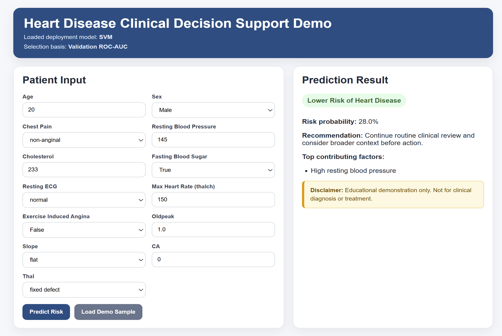

# ❤️ Heart Disease Prediction using Machine Learning

## 👤 Author
**Godbless Keku**  
UCSC Silicon Valley Extension  
---
## 📌 Project Overview

Heart disease is one of the leading causes of death worldwide.  
This project develops a **machine learning-based clinical decision support system** that predicts the presence of heart disease using structured patient data.

The system demonstrates a **complete machine learning pipeline** from data preprocessing to deployment.
---

## ⚙️ Machine Learning Pipeline
Data → Preprocessing → Model → Training → Evaluation → Deployment

---

## 📊 Dataset

- **Source:** UCI Heart Disease Dataset
- Dataset available at: UCI repository link   https://archive.ics.uci.edu/ml/datasets/heart+disease
- **Records:** ~920 samples  
- **Features:** 13 clinical attributes  
- **Target:**  
  - `0` → No Heart Disease  
  - `1` → Heart Disease Present  

### Features Used:
- Age  
- Sex  
- Chest pain type  
- Resting blood pressure  
- Cholesterol  
- Fasting blood sugar  
- Resting ECG  
- Maximum heart rate (**thalch**)  
- Exercise-induced angina  
- ST depression (oldpeak)  
- Slope  
- Number of vessels (ca)  
- Thalassemia  

---

## 🧹 Data Preprocessing

- Removed duplicate records  
- Handled missing values  
- Converted target to binary classification  
- Applied:
  - **Median imputation + scaling** (numeric features)
  - **One-hot encoding** (categorical features)  
- Used **ColumnTransformer pipeline** for consistency  

---

## 🤖 Models Implemented

- Logistic Regression  
- Random Forest  
- Support Vector Machine (SVM)  
- Gradient Boosting  

---

## 🔧 Model Optimization

- Hyperparameter tuning using **GridSearchCV**
- 5-fold cross-validation  
- Scoring metric: **ROC-AUC**

---

## 📈 Model Selection Strategy

✔ Model selection based on **validation performance**  
✔ Test set used **only once** for final evaluation  

👉 This avoids **test-set leakage** and ensures unbiased results  

---

## 📊 Results

| Model | F1 Score | ROC-AUC |
|------|--------|--------|
| Logistic Regression | ~0.84 | ~0.87 |
| Random Forest | ~0.84 | ~0.88 |
| SVM | ~0.83 | **~0.90 (best)** |
| Gradient Boosting | ~0.82 | ~0.89 |

### Key Insights:
- **SVM achieved the best overall discrimination (ROC-AUC)**
- **Random Forest achieved strong recall and F1-score**
- All models performed significantly above random baseline  

---

## 📷 Demo (Clinical Decision Support System)

This project includes a **Flask-based web application** that simulates a clinical decision system:

### Features:
- Input patient clinical data  
- Real-time prediction  
- Risk probability output  
- Explanation of contributing factors  

---

## 🚀 How to Run the Project

### 1. Install dependencies

pip install -r requirements.txt

### 2. Train the model
python train.py

### 3. Run the Demo app
python demo.py

### 4. Open in browser
http://127.0.0.1:5000

## ⚠️ Disclaimer

This application is for educational purposes only and must not be used for clinical diagnosis or medical decision-making.

## 📚 References

UCI Heart Disease Dataset

Scikit-learn Documentation

Machine Learning Literature

## 📷 Demo Screenshot

